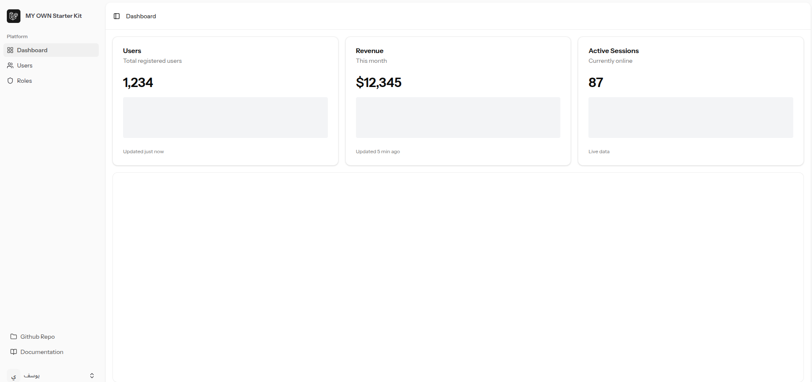
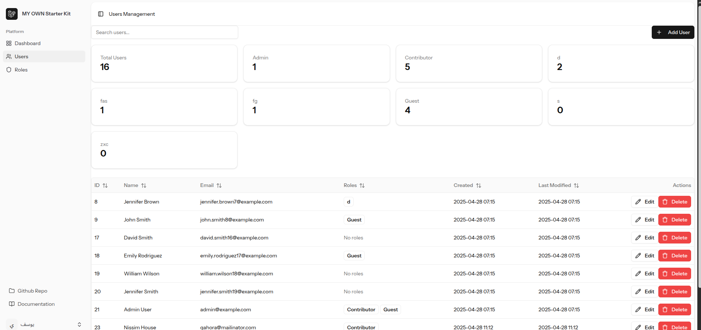
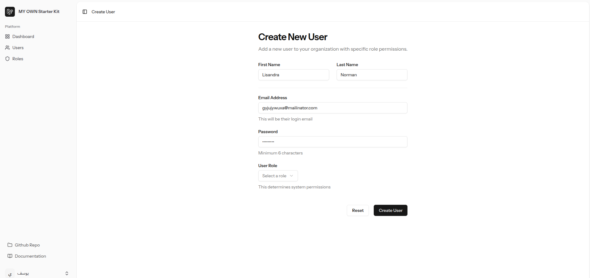
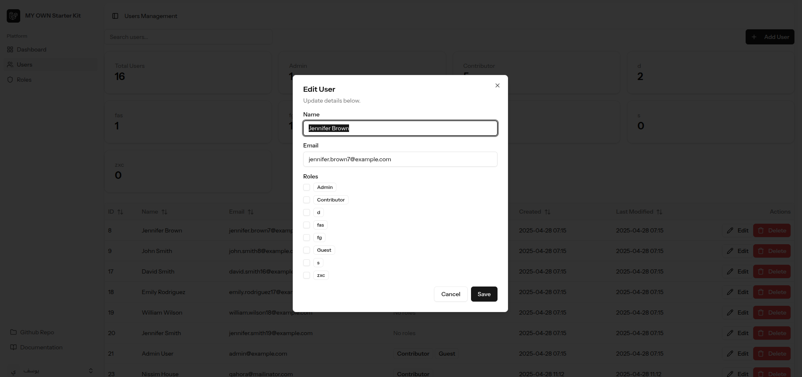
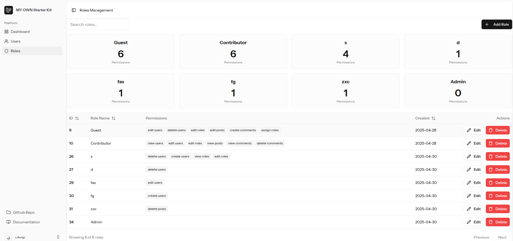
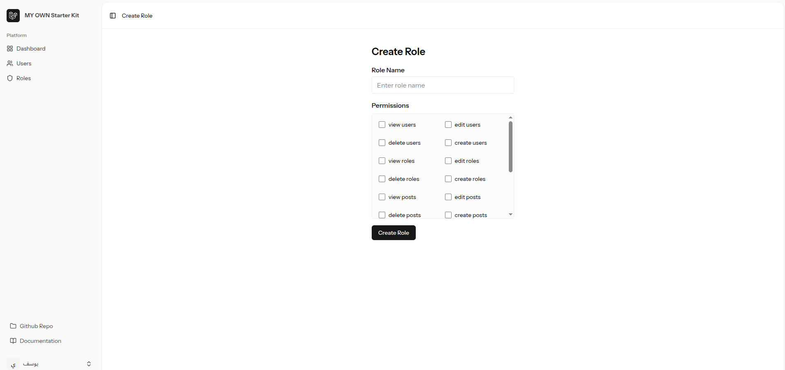

# Laravel Starter Kit 🚀

A powerful and flexible Laravel Starter Kit designed to kickstart your Laravel projects with built-in user roles, authentication, and a Vue.js (Inertia) frontend.

---

## 🔥 Features

- ✅ Laravel 12 + Breeze + Inertia.js (Vue 3)
- ✅ Role-based access control (via Spatie Laravel-Permission)
- ✅ TailwindCSS UI + shadcn/ui
- ✅ Fully responsive design
- ✅ User authentication (login, registration, password reset)
- ✅ User roles and permissions management
- ✅ Reusable components and layouts
- ✅ Ready-to-use user management module
- ✅ Permission-aware interface (e.g., admin-only actions)
- ✅ Full CRUD example (Users, Roles, etc.)

---

## 📸 Screenshots

### 🏠 Dashboard  


### 👥 Users Management  



### 🔐 Roles and Permissions  


---

## 🚀 Getting Started

### 1. Clone the Repository

```bash
git clone https://github.com/itsyosefali/laravel_12_kit.git
cd laravel_12_kit

composer install
```
### 2. Set Up Environment
Copy the `.env.example` file to `.env` and update the database configuration.

```bash
cp .env.example .env
```
### 3. Generate Application Key

```bash
php artisan key:generate
```
### 4. Migrate the Database

```bash
php artisan migrate
```
### 5. Seed the Database (Optional)

```bash
php artisan db:seed
```
### 6. Install NPM Packages

```bash
npm install
```
### 7. Build Assets

```bash
npm run build
```
### 8. Start the Development Server

```bash
composer run dev
```
